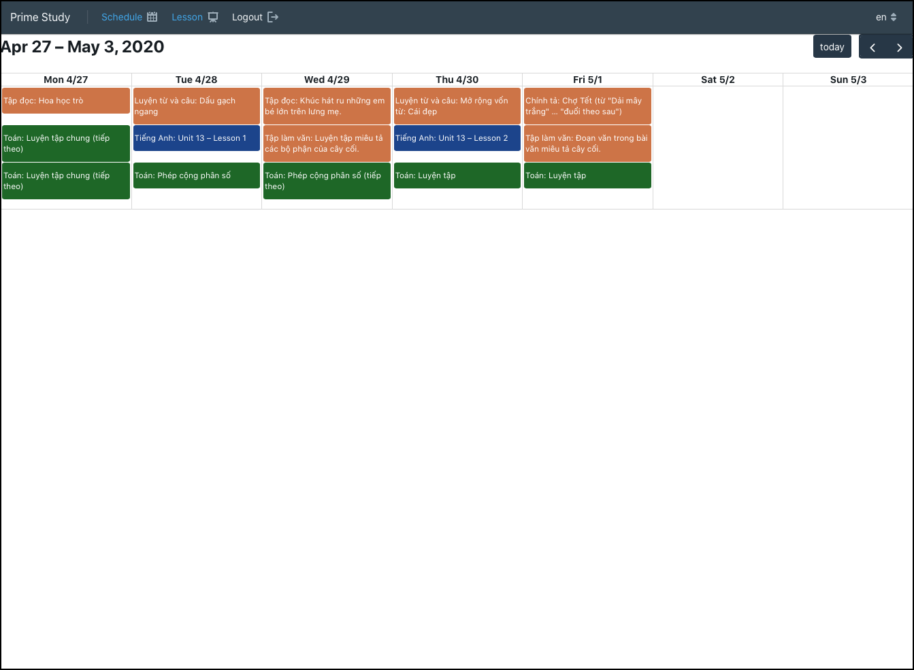

# PrimeStudy

~ A simple online studying system for primary school students and teachers

# Motivation

During Corona Virus Lock-down in Vietnam (March-May 2020), all schools, including primary schools are closed. However, my mother - a teacher, has to keep the teaching activities going during the closing.

There are many online-styding platforms, but none of them provide the simplicity and functionalities that I expect (Students can submit their notebook online for the teacher to check).

I decided to make this system to help my mother with her teaching. This system had been used for her class (around 50 students) until the school was opened (in May 2020).

# Features

- Online studying: Student can view the lesson video, teacher's requirements and submit photos of notebook (for teacher to check)
- Giving feedbacks: Teacher can view students' submission, type some feedbacks or even record audio feedback. Students will be able to view these feedbacks.

# Technology
- Backend: Using CakePHP as CRUD REST API - MySQL database
- Frontend: React and BlueprintJS

# Screenshot

